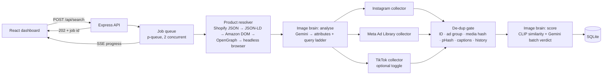

# ReelScout – Product Video Discovery Dashboard

Type a product name or paste a product link (or add a photo) and get **20+ Instagram Reels and 20+ Meta Ad Library video ads**
(plus TikTok as an optional third source) that show **that product**. Each video gets a 0–100 match score with a written reason
from an image-analysis "brain". Repeat searches return **new** videos.

**Stack:** Node.js (Express) · React (Vite) · SQLite · Gemini vision (free tier) + local CLIP · Playwright · Apify

> Demo video: https://drive.google.com/file/d/1uYHLp3mlNDfr_3_HzJFskOIcqJIungVG/view?usp=sharing · Pipeline flow: https://nik8378.github.io/reelscout/flow.html · Test evidence: [docs/TEST-RESULTS.md](docs/TEST-RESULTS.md) · Demo script: [docs/DEMO-SCRIPT.md](docs/DEMO-SCRIPT.md)

---

## Quick start

### Option A: Docker (one command)
```bash
cp .env.example .env        # add GEMINI_API_KEY and APIFY_TOKEN
docker compose up --build   # open http://localhost:8080
```

### Option B: local development
Requires Node 20+.
```bash
cp .env.example .env
cd backend && npm install && npx playwright install chromium && npm run dev   # API on :4000
cd frontend && npm install && npm run dev                                     # UI on :5173
```

### Keys (all free tiers)
| Variable | Where | Used for |
|---|---|---|
| `GEMINI_API_KEY` | aistudio.google.com → Get API key | Image brain (attributes, queries, match verification) |
| `APIFY_TOKEN` | apify.com → Settings → Integrations | Instagram Reels, TikTok, Meta fallback |

Without keys the app still runs: Meta uses the free browser collector, and scoring falls back to local CLIP + caption signals.
The UI says so instead of failing. The first search downloads the CLIP model (~90 MB) once; later searches start immediately.

### Useful scripts (`backend/`)
| Command | What it does |
|---|---|
| `npm test` | 32 tests: SSRF guard, product parsing, normalizers, de-dup, scoring, full pipeline (offline), API |
| `npm run search -- "protein bar"` | Run one full search in the terminal |
| `npm run brain -- "<url or name>"` | Show what the image brain extracts and the query plan |
| `npm run collect -- "protein bar" meta` | Test a single source collector |
| `npm run eval` | Run the 5 test products and write `docs/TEST-RESULTS.md` |
| `npm run models` | List Gemini models your key can use (fallback order) |

---

## Architecture



**Why this shape:** `POST /api/search` returns immediately and the pipeline runs in a background queue, so slow sources never
block a request. Progress streams over **Server-Sent Events** (one-way and simple, with automatic replay for late subscribers).
The three collectors run **in parallel** with `Promise.allSettled`. Each has its own retries, timeouts and error report, so one
failing source never breaks the search.

| Layer | Choice | Why |
|---|---|---|
| Backend | Express + SSE | Small, well understood; SSE is enough for one-way progress |
| Queue | p-queue + job event log | No extra infrastructure; jobs survive client reconnects; interrupted jobs are marked failed at startup |
| Data store | SQLite (better-sqlite3, WAL) | Zero setup for reviewers; handles history, de-dup indexes, caching and the shortlist |
| Vision | Gemini Flash (free) + local CLIP | Gemini explains *why* something matches; CLIP is free, unlimited and keeps working when Gemini is rate-limited |
| Frontend | React + Vite, plain CSS | Fast build, no UI-kit lock-in, fully responsive |

---

## How each video source is collected

| Source | Primary method | Fallback | Why |
|---|---|---|---|
| **Instagram Reels** | Apify `instagram-hashtag-scraper` (Reels only) | Apify `instagram-scraper` on hashtag pages | Instagram has no public search API and hashtag pages need a login. A provider avoids running logged-in accounts, which would be a ToS risk. |
| **Meta Ad Library** | **Free:** Playwright opens the *public* Ad Library page (no login, `media_type=video`) and reads the ads JSON the page itself loads, scrolling for more | Apify `facebook-ads-library-scraper` | The official Ad Library API only returns political/issue ads and EU-delivered ads, and it has no video URLs, so it can't meet this brief. |
| **TikTok** (bonus) | Apify `tiktok-scraper` (keyword + hashtag search) | – | Behind its own toggle; never blocks the required sources |

**TikTok from India.** TikTok's app and website are blocked in India (government order, 2020), so ReelScout never calls tiktok.com.
The Apify actor runs on servers outside India and returns video ID, caption, creator, date and cover image; the backend only talks to
api.apify.com. TikTok videos are scored like any other source, but are not streamed or re-hosted: the detail panel offers to copy the
link instead. TikTok has its own toggle and no minimum, so it can never block the two required sources.

**Query ladder (how we reach 20).** The brain turns the product into ordered queries, from exact to broad:
exact name → brand + product type → **brand alone** (finds the brand's own ads) → descriptive ("black skull print oversized tee")
→ broad category → review/best/unboxing variants, plus specific-first hashtags. Each source keeps a cursor over this ladder. It
fetches, de-duplicates, scores, and if fewer than 20 pass, **widens to the next queries for up to 3 rounds**.

**Rate limits, blocks, login walls, missing data**
- Every call has a timeout and up to 2 retries with exponential backoff; Apify network blips get one immediate retry.
- Invalid token, used-up credit or a missing actor stop **only that source**, with a clear message in the UI.
- Raw provider responses are cached for 24 h (`RAW_CACHE_HOURS`), so repeated runs cost no credits.
- Login walls: never automated. Instagram goes through a provider; Meta uses the public, logged-out Ad Library page.
- Missing data: items without video (image or carousel ads) are dropped. Missing thumbnails are scored "no thumbnail" and marked
  below threshold.
- **Shortfall:** if a source still has fewer than 20 after all rounds, the search completes and the UI shows a banner, for
  example *"Found 17 of 20 after 6 queries (4 more below the match threshold). All query variations were tried."* It never fails
  silently.

---

## The image brain

**1. Analyse the product (one Gemini call, cached by image hash).** From the product photo plus page text it extracts product type,
category, brand, colours, print/graphic, logos, text on the product, material, shape and 3–5 *distinctive features*. It returns
them as **schema-validated JSON** (`responseSchema`), together with exact/descriptive/broad queries and hashtags.

**2. Score every video, 0–100.**
- **CLIP** (ViT-B/32, runs locally) embeds the product photo and each thumbnail. Cosine similarity is calibrated to 0–100
  (packshot vs. lifestyle shot of the same product ≈ 0.75–0.85).
- **Gemini** sees the reference photo plus 10 thumbnails per call and returns, for each one, a score, a short reason, and a
  match/partial/no check for print, colour, shape, logo/text and whether the product is visible. Captions are given as hints only.
- **Final = 0.35 × CLIP + 0.65 × Gemini.** The vision model decides; CLIP keeps it grounded and ranks which candidates are worth
  a Gemini call (top 40 per round).
- **Keyword search without a photo:** Gemini judges "does this show *this type* of product" (any brand unless one is named), and
  CLIP compares thumbnails against a text embedding.

**Thresholds**
| Score | Label | Shown |
|---|---|---|
| ≥ 70 | Exact match | yes |
| 50–69 | Close match | yes, labelled |
| < 50 | Below threshold | hidden by default (filter "All" shows them, faded) |

Every score shows its **reason** in the UI. The detail drawer adds the CLIP/Gemini breakdown, the attribute checks and the query
that found the video.

**Staying inside free limits and degrading gracefully**
- All Gemini calls go through one queue at 5 requests/min (the free-tier limit), with a 90 s verification budget per round.
- Busy or over-quota models are benched for 3 minutes, and the brain **switches to the next available model**: it asks Google which
  models the key can use, so there are no hard-coded names. If every model is busy, scoring uses **CLIP + caption/brand signals**
  for 2 minutes and then retries Gemini automatically. Only a rejected API key disables the vision model.

Accuracy results for 5 products: see [docs/TEST-RESULTS.md](docs/TEST-RESULTS.md).

---

## Uniqueness and de-duplication

Two stages: cheap checks first, image checks after the thumbnail is downloaded.

| Check | Catches | When |
|---|---|---|
| `platform:nativeId` | the same post/ad twice | before download |
| Meta `collation_id` | **the same ad running under several IDs** | before download |
| media hash (host + path, query string stripped) | the same video file behind different signed URLs | before download |
| history (all earlier searches) | videos already shown before | before download |
| perceptual hash (64-bit DCT pHash) **and its mirrored version**, Hamming ≤ 10 | re-uploads, re-encodes, crops, mirrored ads | after thumbnail |
| caption word overlap ≥ 85% (Instagram/TikTok only) | reposts with copied captions | after thumbnail |

The pHash threshold was measured: copies (resized, JPEG-recompressed, 3% cropped) differ by ≤ 12 bits and usually ≤ 8;
different images differ by ≥ 24. Captions are not used for Meta, because brands reuse the same copy across different creatives.

Every returned video is stored with the search that returned it (`videos` + `search_results`). When a new search meets a video
from an earlier search, it is skipped (never re-scored, never counted toward the 20) and recorded with its earlier score as
`previously_seen`. The **Show previously seen** filter brings those back deliberately, flagged "Seen before". A repeat keyword
search therefore only shows new videos; the offline pipeline test asserts this. De-dup stats are shown per search ("Duplicates removed").

---

## Backend API

| Method | Path | Notes |
|---|---|---|
| POST | `/api/search` | `{ q, image?, options: { tiktok, includeSeen } }` → `202 { id }`. Input validated with zod; unsafe URLs rejected before queueing; 10 searches/min |
| GET | `/api/search/:id/stream` | SSE: `stage`, `product`, `source`, `results`, `done`, `error`; replays history to late subscribers |
| GET | `/api/search/:id` | Product, analysis, per-source report, all videos with scores and reasons |
| GET | `/api/search/:id/export.csv` | Matched videos as CSV |
| GET | `/api/history` | Earlier searches with per-source counts |
| GET/POST/DELETE | `/api/shortlist`, `/api/shortlist/export.csv` | Shortlist + CSV export |
| GET | `/api/health` | Missing keys, vision model status, thresholds, queue |

**Security**
- SSRF guard: http/https only, no credentials, ports 80/443 only, DNS resolved and private/loopback/link-local/metadata IPs blocked,
  every redirect re-checked, 5 MB / 15 s limits. The headless-browser fallback applies the same check to every page it navigates to.
- Uploads are limited to PNG/JPEG/WebP, max 8 MB, re-encoded with sharp.
- CSV export is protected against formula injection. Helmet headers, rate limits, and secrets only in `.env` (`.env.example`
  committed).

**Caching:** product pages for 3 days (by URL), image analysis for 14 days (by image hash + text), CLIP reference embeddings,
raw source responses for 24 h, and thumbnails stored locally by content hash (platform CDN links expire).

**Logging:** structured pino logs (per collector step: query, raw count, fresh count; model switches; retries), and consistent
error JSON: `{ error: { code, message, hint } }`.

---

## Dashboard

- Search bar for keyword or product URL (auto-detected), optional image upload and a TikTok toggle.
- Live pipeline bar: fetch → analyse → Instagram → Meta → TikTok → score, with live counts and the current query.
- Summary tiles: per-source counts against the 20 minimum, average score, and duplicates removed.
- Product panel: image, title, source, and the brain's attributes, distinctive features and queries.
- Notices: shortfalls, failed sources, vision-model status, each with a next step.
- Results: per-platform tabs with an `x/20` counter, plus filters applied instantly to loaded results: text search (caption, creator,
  reason), match level (exact / close / below threshold / all), posted date, sort (best, lowest, newest, oldest), "Show previously
  seen" and "Shortlisted only".
- Video cards: thumbnail, platform badge, score bar, verdict, reason, caption, author, date, link, shortlist.
- Detail drawer: inline video player (or a link to the original), score breakdown and attribute checks.
- History sidebar, shortlist CSV export, error/empty/offline states, and a layout that works on desktop and tablet.

---

## Testing

- **32 automated tests** (`cd backend && npm test`): SSRF guard, product parsing, normalizers, de-duplication (incl. mirrored
  re-uploads and the same ad under several IDs), scoring and fallbacks, the full pipeline offline, and the API.
- **Live end-to-end runs** with real Instagram, Meta and TikTok data, including Gemini overload and provider credit running out.
- **Manual UI checklist** for every dashboard feature.

Details and what is still unchecked: [docs/TESTING.md](docs/TESTING.md).

## Results (5 test products)

Full report with good, borderline and rejected examples per product: [docs/TEST-RESULTS.md](docs/TEST-RESULTS.md).

| Product | Input | Instagram | Meta | TikTok | Avg score | Notes |
|---|---|---|---|---|---|---|
| Oversized graphic tee | keyword | **23 / 20** | **26 / 20** | 30 | 70 | both minimums met |
| Vitamin C face serum | keyword | **22 / 20** | 13 / 20 | 28 | 70 | Meta shortfall after 5 widened queries, reported in the UI |
| Wireless earbuds | keyword | **24 / 20** | **24 / 20** | 0 | 72 | TikTok stopped: Apify free credit used up |
| RiteBite protein bar | Amazon link | 0 / 20 | 0 / 20 | 0 | – | 402 duplicates removed: every match had been shown in earlier dev searches |
| Allbirds Tree Runner | Shopify link | 0 / 20 | 6 / 20 | 0 | 54 | Apify credit ran out mid-run; free Meta collector kept working |

What this shows: with provider credit available, keyword searches reliably reach 20 + 20 with average scores around 70. The two
link searches were limited by the free Apify credit and by de-duplication against earlier searches, not by the pipeline; the
UI reported both clearly. Gemini's free tier was overloaded during the run and the brain switched models automatically.

## Known limitations (honest)

- **Free tiers.** Gemini's free tier is 5 requests/min per model and is sometimes overloaded. The app degrades to CLIP + captions
  and says so, but explanations are richer when Gemini is available. Apify's free $5/month covers roughly 10–25 full searches;
  the 24 h raw cache helps during development.
- **Meta browser collector.** It depends on the public Ad Library page structure. If Meta changes it, the Apify fallback takes over.
- **Instagram via a provider.** Results depend on hashtag coverage. Niche or brand-new products may legitimately have fewer than
  20 Reels; the UI reports the shortfall and what was tried.
- **Thumbnails only.** Scoring uses the cover frame, not every frame, so a product that only appears mid-video can be under-scored.
- **Inline playback.** Instagram/TikTok video URLs are signed and expire, so the drawer may fall back to "open original".
- **Single node.** p-queue and SQLite are fine for one instance; scaling out needs a shared queue and database.

## What I would build next

1. **Multi-frame scoring:** sample 3–5 frames per video (ffmpeg) and score the best frame.
2. **Redis + BullMQ and Postgres + pgvector** for horizontal scaling and similarity search across all stored videos.
3. **Region filters** for Meta (country) and creator/advertiser filters; a feedback loop where 👍/👎 on cards tunes the threshold.
4. A **labelled evaluation set** (precision@20 per product) run in CI on every change to the brain.
5. More providers per source (e.g. a second Instagram data API) with automatic failover based on health checks.
